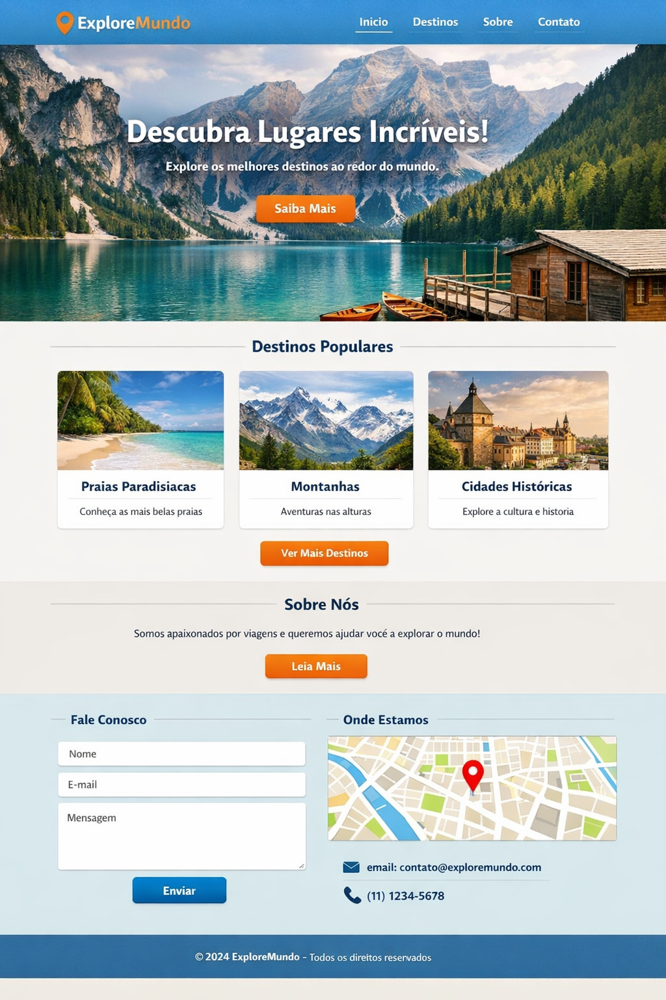

# 🌍 ExploreMundo - Site de Viagens

Projeto acadêmico de desenvolvimento web front-end, focado na criação de uma interface responsiva e moderna para uma agência de viagens fictícia, seguindo um layout de referência.

## 🔗 Link do Projeto ao Vivo
https://luizcmaia.github.io/AtividadeSiteViagem/

## 🎯 Objetivo da Atividade
Montar o site de viagens "ExploreMundo" com base em uma imagem de referência, implementando:
* Uma página principal (`index.html`) fiel ao design original.
* Uma página secundária (`destinos.html`) mantendo a mesma identidade visual.
* Utilização estrita de HTML5 e CSS3 puro (sem uso de frameworks como Bootstrap ou React).
* Publicação do projeto via GitHub Pages.

## 🛠️ Tecnologias Utilizadas
* **HTML5:** Estruturação semântica do conteúdo.
* **CSS3:** Estilização, variáveis de cores, efeitos de hover.
* **Flexbox & CSS Grid:** Para o alinhamento responsivo dos menus, cards de destinos e formulário de contato.

## 👨‍💻 Autor
* **Luiz Miguel Caixêta Maia**
* Curso: Sistemas de Informação/Programação para Web
* Instituição: Centro Universitário Euro (UNIEURO)
